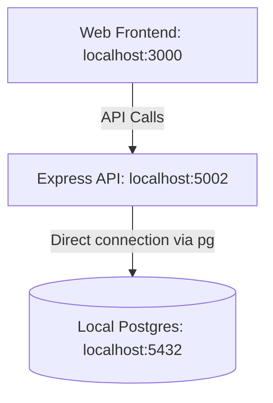
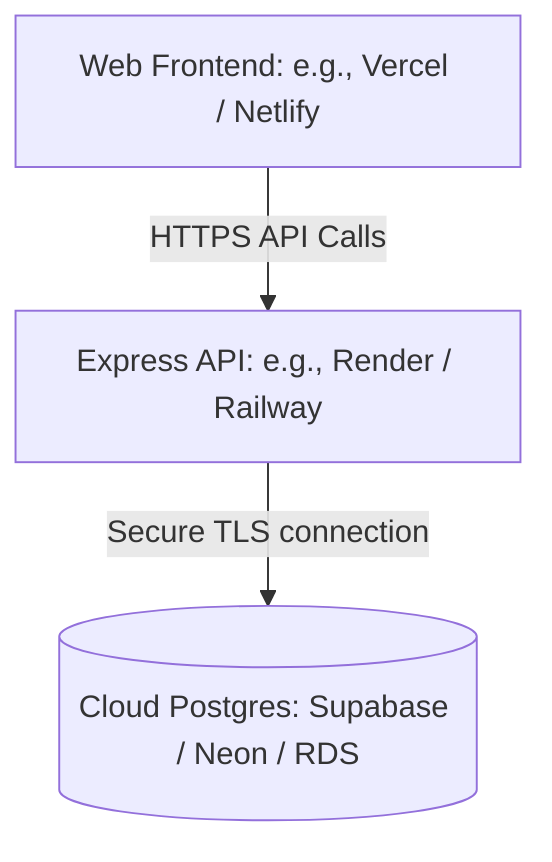

# Migration Plan: Moving Local PostgreSQL Database to a Remote Server

This plan provides a step-by-step roadmap to migrate your **Workout Analyzer** project database from your local machine to a remote, production-grade cloud database server, and deploy the entire application.

---

## Architecture Overview

### Current (Local Setup)


### Target (Remote Setup)


---

## Step 1: Export Local Schema and Data
First, create a complete backup (SQL dump) of your local database schema and data using PostgreSQL's native utility `pg_dump`.

### Commands to Run
Run this in a regular PowerShell terminal (substitute your Postgres username if different from `postgres`):

```powershell
# Export schema and data to a single SQL script file
pg_dump -U postgres -d "Workout Analyzer" -f "workout_analyzer_dump.sql"
```

> [!NOTE]
> This command will prompt you for your local PostgreSQL password (`Admin@123`).
> The output `workout_analyzer_dump.sql` contains the commands to reconstruct all tables, constraints, sequences, and seed the current records.

---

## Step 2: Choose a Cloud Database Provider
Choose a PostgreSQL hosting service that fits your project. Here are the top three recommended options:

| Service | Best For | Pros | Free Tier? |
| :--- | :--- | :--- | :--- |
| **Supabase** | Rapid development, modern features | Built-in authentication, storage, edge functions, and an intuitive SQL GUI. | **Yes** (2 free projects, 500MB DB) |
| **Neon** | Serverless workflows | Branching capabilities, instant scaling, and extremely fast cold starts. | **Yes** (0.5 GiB storage, serverless compute) |
| **Railway / Render** | All-in-one deployment | You can host the database + the Express API + the Frontend in one place. | **Yes** (Trial credits) |

### Recommending Supabase
Since the project context already contains a configured **Supabase MCP Server**, migrating to **Supabase** is highly recommended and offers native integrations.

---

## Step 3: Recreate Schema and Seed Remote Database

If you want to create a clean database or if you prefer running SQL statements manually instead of a full dump, you can execute the following reconstructed DDL scripts in your cloud database provider's SQL editor (e.g. Supabase SQL Editor).

### Reconstructed DDL Script (Table Schema Creation)
```sql
-- Enable UUID extension if not enabled
CREATE EXTENSION IF NOT EXISTS "uuid-ossp";

-- 1. Customers Table
CREATE TABLE customers (
    id UUID PRIMARY KEY DEFAULT gen_random_uuid(),
    email TEXT NOT NULL UNIQUE,
    name TEXT,
    password TEXT NOT NULL,
    created_at TIMESTAMPTZ DEFAULT CURRENT_TIMESTAMP,
    last_login TIMESTAMPTZ
);

-- 2. Exercises Table
CREATE TABLE exercises (
    id UUID PRIMARY KEY DEFAULT gen_random_uuid(),
    name VARCHAR(255) UNIQUE,
    description TEXT,
    category VARCHAR(255),
    subcategory VARCHAR(255),
    image_path VARCHAR(255),
    video_path VARCHAR(255),
    status BOOLEAN DEFAULT true,
    created_at TIMESTAMPTZ DEFAULT CURRENT_TIMESTAMP
);

-- 3. Exercise Pose Rules Table
CREATE TABLE exercise_pose_rules (
    id UUID PRIMARY KEY DEFAULT gen_random_uuid(),
    exercise_id UUID REFERENCES exercises(id) ON DELETE CASCADE,
    rule_name VARCHAR(255),
    rule_type VARCHAR(255),
    threshold_value JSONB,
    feedback_message TEXT,
    severity VARCHAR(255),
    created_at TIMESTAMPTZ DEFAULT CURRENT_TIMESTAMP,
    exercise_name VARCHAR(255),
    UNIQUE (exercise_id, rule_name)
);

-- 4. Tracking Configs Table
CREATE TABLE tracking_configs (
    id VARCHAR(255) PRIMARY KEY DEFAULT 'global',
    model_type VARCHAR(255) DEFAULT 'full',
    ui_smoothing NUMERIC DEFAULT 0.3,
    engine_smoothing NUMERIC DEFAULT 0.0,
    created_at TIMESTAMPTZ DEFAULT CURRENT_TIMESTAMP
);

-- 5. Voice Configs Table
CREATE TABLE voice_configs (
    id VARCHAR(255) PRIMARY KEY DEFAULT 'global',
    min_interval_ms INT NOT NULL DEFAULT 2200,
    phrase_cooldown_ms INT NOT NULL DEFAULT 4000,
    reinforcement_probability NUMERIC NOT NULL DEFAULT 0.70,
    speech_rate NUMERIC NOT NULL DEFAULT 1.05,
    speech_pitch NUMERIC NOT NULL DEFAULT 1.00,
    positive_reinforcements TEXT[] NOT NULL DEFAULT ARRAY[
        'Perfect form!', 
        'Excellent depth!', 
        'Great repp!', 
        'Spot on!', 
        'Nice job!', 
        'Keep it up!', 
        'Amazing control!'
    ],
    created_at TIMESTAMPTZ DEFAULT CURRENT_TIMESTAMP,
    updated_at TIMESTAMPTZ DEFAULT CURRENT_TIMESTAMP
);

-- 6. Voice Cues Table
CREATE TABLE voice_cues (
    id UUID PRIMARY KEY DEFAULT gen_random_uuid(),
    exercise_name VARCHAR(255) NOT NULL,
    exercise_id UUID REFERENCES exercises(id) ON DELETE SET NULL,
    raw_cue VARCHAR(255) NOT NULL,
    spoken_cue VARCHAR(255),
    is_active BOOLEAN NOT NULL DEFAULT true,
    created_at TIMESTAMPTZ DEFAULT CURRENT_TIMESTAMP,
    updated_at TIMESTAMPTZ DEFAULT CURRENT_TIMESTAMP,
    UNIQUE (exercise_id, raw_cue)
);

-- 7. Voice Failure Guidance Table
CREATE TABLE voice_failure_guidance (
    id UUID PRIMARY KEY DEFAULT gen_random_uuid(),
    failure_keyword VARCHAR(255) NOT NULL UNIQUE,
    spoken_advice VARCHAR(255) NOT NULL,
    is_active BOOLEAN NOT NULL DEFAULT true,
    created_at TIMESTAMPTZ DEFAULT CURRENT_TIMESTAMP,
    updated_at TIMESTAMPTZ DEFAULT CURRENT_TIMESTAMP
);

-- 8. Workout Sessions Table
CREATE TABLE workout_sessions (
    id UUID PRIMARY KEY DEFAULT gen_random_uuid(),
    customer_id UUID REFERENCES customers(id) ON DELETE CASCADE,
    exercise_id UUID REFERENCES exercises(id) ON DELETE SET NULL,
    start_time TIMESTAMPTZ DEFAULT CURRENT_TIMESTAMP,
    end_time TIMESTAMPTZ,
    total_reps INT DEFAULT 0,
    average_accuracy NUMERIC,
    total_duration_seconds INT,
    status VARCHAR(255) DEFAULT 'active'
);

-- 9. Workout Attempts Table
CREATE TABLE workout_attempts (
    id UUID PRIMARY KEY DEFAULT gen_random_uuid(),
    session_id UUID REFERENCES workout_sessions(id) ON DELETE CASCADE,
    exercise_id UUID REFERENCES exercises(id) ON DELETE SET NULL,
    status VARCHAR(255),
    reason TEXT,
    created_at TIMESTAMPTZ DEFAULT CURRENT_TIMESTAMP
);

-- 10. Workout Rep Logs Table
CREATE TABLE workout_rep_logs (
    id UUID PRIMARY KEY DEFAULT gen_random_uuid(),
    session_id UUID REFERENCES workout_sessions(id) ON DELETE CASCADE,
    rep_number INT,
    start_frame_time TIMESTAMPTZ,
    top_frame_time TIMESTAMPTZ,
    end_frame_time TIMESTAMPTZ,
    quality_score NUMERIC,
    duration_seconds NUMERIC,
    status VARCHAR(255),
    attempt_id UUID REFERENCES workout_attempts(id) ON DELETE SET NULL
);

-- 11. Workout Deviation Logs Table
CREATE TABLE workout_deviation_logs (
    id UUID PRIMARY KEY DEFAULT gen_random_uuid(),
    session_id UUID REFERENCES workout_sessions(id) ON DELETE CASCADE,
    rep_id UUID REFERENCES workout_rep_logs(id) ON DELETE CASCADE,
    deviation_type VARCHAR(255),
    feedback_message TEXT,
    severity VARCHAR(255),
    frame_number INT,
    created_at TIMESTAMPTZ DEFAULT CURRENT_TIMESTAMP
);

-- 12. Workout Landmark Frames Table
CREATE TABLE workout_landmark_frames (
    id UUID PRIMARY KEY DEFAULT gen_random_uuid(),
    session_id UUID REFERENCES workout_sessions(id) ON DELETE CASCADE,
    rep_id UUID REFERENCES workout_rep_logs(id) ON DELETE CASCADE,
    frame_number INT,
    landmarks JSONB,
    frame_type VARCHAR(255),
    timestamp TIMESTAMPTZ DEFAULT CURRENT_TIMESTAMP
);

-- 13. Workout Joint Angles Table
CREATE TABLE workout_joint_angles (
    id UUID PRIMARY KEY DEFAULT gen_random_uuid(),
    session_id UUID REFERENCES workout_sessions(id) ON DELETE CASCADE,
    rep_id UUID REFERENCES workout_rep_logs(id) ON DELETE CASCADE,
    angle_name VARCHAR(255),
    angle_value NUMERIC,
    frame_number INT,
    created_at TIMESTAMPTZ DEFAULT CURRENT_TIMESTAMP
);
```

### Seeding Initial Data
You can seed default exercises and parameters using the CSV files already located in your local project workspace directory:
- `Docs/Default Exercises.csv` -> Import to `exercises` table
- `Docs/Default Exercise Rules.csv` -> Import to `exercise_pose_rules` table
- `Docs/Default Voice Cues.csv` -> Import to `voice_cues` table
- `Docs/Default Voice Failure Rules.csv` -> Import to `voice_failure_guidance` table
- `Docs/Default_VoiceConfigs.csv` -> Import to `voice_configs` table
- `Docs/Default AI Model Config.csv` -> Import to `tracking_configs` table

Most web GUIs (like Supabase Studio or Neon Console) support direct CSV uploads for specific tables.

---

## Step 4: Update Backend Configuration
Once the cloud database is up and running:

1. **Obtain Connection String**: Get the transaction-pool or direct connection URI from your provider dashboard. It will look like this:
   `postgresql://postgres:[PASSWORD]@[HOST]:5432/postgres?sslmode=require`

2. **Update Environment File**:
   Modify [apps/api/.env](file:///e:/Pro/Workout%20Analyzer/apps/api/.env):
   ```env
   PORT=5002
   DATABASE_URL="postgresql://postgres:[YOUR_DB_PASSWORD]@[YOUR_DB_HOST]:5432/postgres?sslmode=require"
   ```

3. **Check SSL Configurations**:
   Cloud databases usually require SSL connections. The Express backend uses `pg` directly. Node-postgres automatically handles SSL if `?sslmode=require` is in the connection string, or if you configure the pool options:
   
   If needed, we can update [apps/api/src/db.ts](file:///e:/Pro/Workout%20Analyzer/apps/api/src/db.ts) to support strict SSL verification bypasses common in serverless or cloud setups:
   ```typescript
   const pool = new Pool({
     connectionString: process.env.DATABASE_URL,
     ssl: process.env.NODE_ENV === 'production' ? { rejectUnauthorized: false } : false
   });
   ```

---

## Step 5: Hosting the Whole Project
To put the entire project online, follow this host deployment stack:

### 1. Database Server
- **Supabase** / **Neon**.

### 2. Express Backend API (`apps/api`)
- **Render** or **Railway**:
  - Connect your GitHub repository.
  - Set root directory to `apps/api`.
  - Add your environment variables: `PORT=5002`, `DATABASE_URL` (remote connection string).
  - Add a start command: `npm run build && npm run start` or `node dist/index.js`.

### 3. Frontend App (`apps/web`)
- **Vercel** or **Netlify**:
  - Connect your GitHub repository.
  - Set root directory to `apps/web`.
  - Set build command: `npm run build`.
  - Add environmental variable referencing the remote backend: e.g. `NEXT_PUBLIC_API_URL=https://your-api-server.onrender.com`.

---

## Verification Plan

### Automated Tests
- Run `npm run dev` in `apps/api` locally with the updated remote database URL and confirm `Database connection successful` prints on server start.
- Test endpoint health check `/db-test` to ensure successful queries to the remote DB.

### Manual Verification
- Perform a session practice in the browser and verify workout reps, logs, deviations, and frame details are successfully written to the remote cloud tables.
